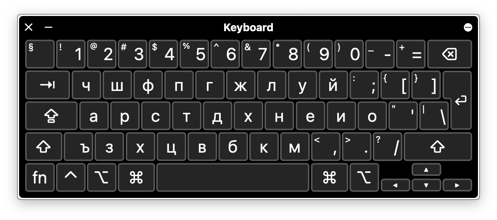

# Vilem's Bulgarian Flavoured Colemak for MacOS

You should probably not use this. I cobbled it together in a few minutes.

## Here goes

### Base

### Shift

### Option

### Option + Shift

## Bugs

- Command key combos won't work. _Really_ annoying. Please drop me a line if you know how to fix this.
- And more..!

## Installation

I think this should work?

### Step 1

#### Method a

~~~ console
sudo cp colemak-bg.icns colemak-bg.keylayout '/Library/Keyboard Layouts/'
~~~

#### Alternatively, method b

~~~ console
open . && open '/Library/Keyboard Layouts/'
~~~

And then drag and drop.

### Step 2

Restart.

### Step 3

System Preferences > Keyboard layouts > + > scroll, scroll, scroll > Others > Colemak – Bulgarian

### Step 4

Грейт съксес!
